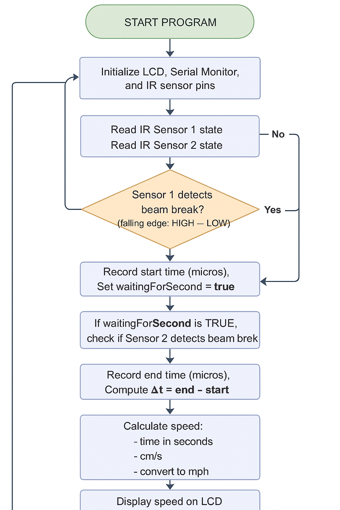
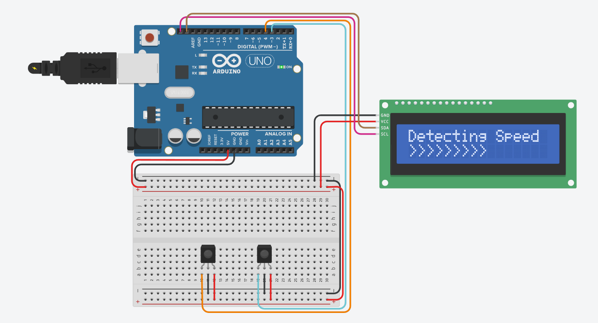
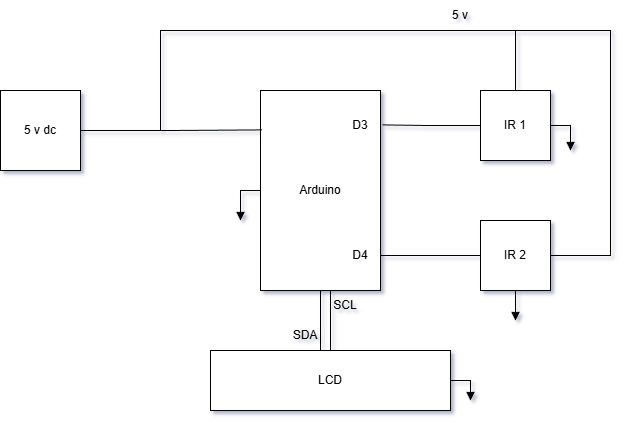

# **Speed Monitoring System**

An embedded system project that measures the real-time speed of a moving object using two IR break-beam sensors. The system calculates speed based on the time it takes an object to travel between the two sensors and presents the results on an I2C LCD display. Timing and speed data are also sent to the Serial Monitor for verification and debugging.

---

## **Overview**

The **Speed Monitoring System** leverages precise microsecond timing from the Arduino Uno R4 WiFi to compute object velocity. When an object passes through IR Sensor 1 and IR Sensor 2, the system captures the time interval and computes the speed in cm/s, then converts it to m/s for clearer LCD output.

During testing, readings in miles per hour appeared too small on the LCD to be visually readable. To improve clarity, the final speed readout is displayed in **meters per second (m/s)**.

---

## **Components Used**

- **Arduino Uno R4 WiFi**  
- **2 × IR Sensor Modules (Break-Beam/Obstacle Detection)**  
- **16×2 LiquidCrystal I2C Display**  
- **Breadboard**  
- **Breadboard Power Supply**  
- **USB-A to USB-C Cable**  
- **Jumper Wires**  
- **Ruler (for sensor spacing measurement)**  
- **Test Object**

---
## **Program Flow-chart**

---

## **System Features**

- High-precision timing using `micros()`
- Detects falling-edge transitions on IR sensors
- Calculates speed in **cm/s**, displayed in **m/s**
- Real-time results on I2C LCD
- Diagnostic timing and speed output via Serial Monitor
- Simple 2-wire I2C interface for LCD communication
- Compact and easy-to-build hardware setup

---

## **Hardware Setup**
### **Pictorial View**

---
### **Block Diagram**

---
| Component | Arduino Pin |
|----------|--------------|
| IR Sensor 1 Output | D4 |
| IR Sensor 2 Output | D3 |
| LCD SDA | SDA |
| LCD SCL | SCL |
| Power (Sensors & LCD) | 5V / GND |

- Position IR Sensor 1 and IR Sensor 2 exactly **9 cm apart**.  
- Ensure sensors output **HIGH when idle** and **LOW when triggered**.

---

## **Speed Calculation**

1. Object triggers **Sensor 1** → record `previous_time` (µs)  
2. Object triggers **Sensor 2** → record `time_now` (µs)  
3. Time difference:  
---
## **How to Use**

- Power the Arduino Uno R4 WiFi.
- Place the object in front of the first IR sensor to trigger measurement.
- Move the object through the second IR sensor.
- Speed is displayed on the LCD in meters per second (m/s).
- Serial Monitor (115200 baud) prints:
  - Time difference (µs)
  - Calculated speed (cm/s)
---
## **Testing Notes**

- Speed values in mph were too small to be clearly visible on the LCD.
- Displaying the speed in m/s greatly improved readability.
- Accurate measurement depends on:
  - Consistent sensor spacing
  - Straight, continuous motion path
  - Stable lighting conditions (IR logic)
---
## **Future Improvements**

- Add debounce or noise filtering for IR sensors
- Implement averaging for more stable results
- Add support for mph, km/h, or user-selectable units
- Integrate data logging (SD card or serial plotter)
- Create a 3D-printed enclosure or sensor mount
